[toc]

# Introduction.

In order to better understand the class diagrams and their notation, the following is a complete example. In addition, the ArgoUML modeling environment has been used to create these UML diagrams. This environment specializes in modeling with UML and other graphical languages. It also allows you to both generate code from diagrams and generate diagrams from source code.

The ArgoUML application can be used from Windows, Linux, and MacOS X operating systems. The exercise format will be used to provide step-by-step instructions on how to create a class diagram based on the requirements of a statement.

>**Example of invoice management**
>
>Invoices from a company's suppliers can be from service providers or from suppliers of products or materials. Each of the invoices, of either type, has in common:
>
>- The invoice number.
>- The date of the invoice.
>- The total amount - which is calculated differently in some than in others.
>- Customer data, which is the NIF and name, and must be found in a separate class.
>- The detail of the invoice (whether it is materials or services).
>
>For both service invoices and product or material invoices, the last invoice issued must be kept in order to keep the invoice number in mind. 
>
>There is a list of services with the description and price per hour of each.
>
>The details of the invoices must include:
>
>- In the invoices for services, each invoice contains a list of services with the date of service, the number of hours spent, and the price / hour per service. There may be more than one benefit from the same service on an invoice.
>
>- Product invoices must include a description, unit price, and quantity for each product (each invoice must have at least one).
>
>  
>
# ArgoUML
The latest available version (0.35.1) can be found among the releases in the tigris github profile (https://github.com/argouml-tigris-org/argouml/releases).

We can download the zip file (https://github.com/argouml-tigris-org/argouml/releases/download/VERSION_0_35_1/ArgoUML-0.35.1.zip) and unzip it on our PC.

All releases are cross-platform, depending on whether we are on Linux, Windows, etc. we will launch the correct executable (sh, bat, etc...)

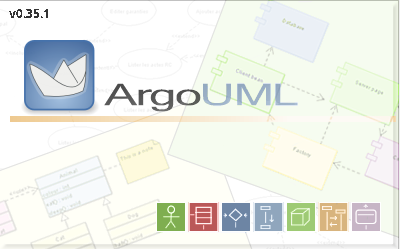

Once opened we will see something similar to this:

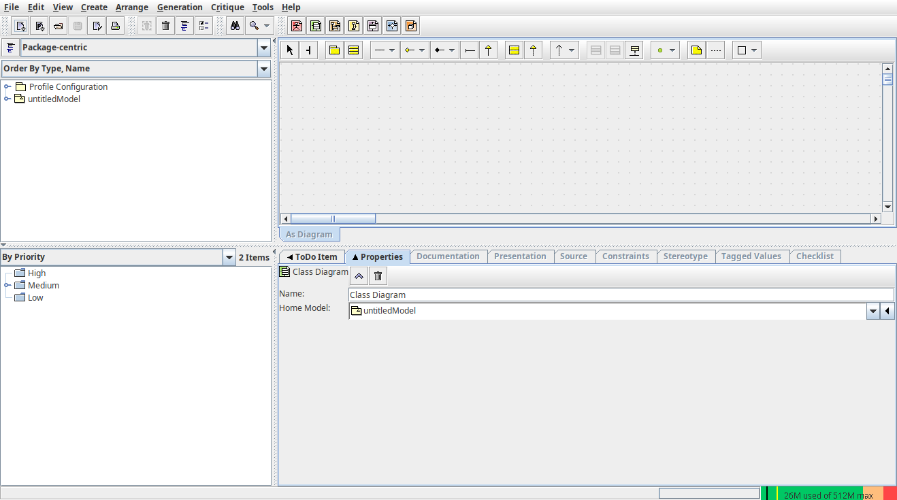

# Our example step by step

## Start ArgoUML

To start working with argoUML, it is only necessary to start the application, since it is entirely dedicated to the design of UML diagrams. By default it creates an empty untitledModel (that we can rename) with two empty diagrams (class and use case). By right-clicking on the model, we can choose to create more diagrams, like sequence diagrams...etc.

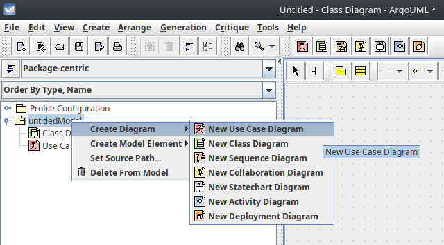

By now we only need to rename our model to InvoicesManagement:

## Basic ArgoUML

The start screen is actually very intuitive, containing a bar of entities that are identified by their own UML symbols.

To start drawing classes, click on the class box (the second in the palette), and mark some point in the drawing area. The class will appear, without any associated information.

In the lower right part of the window, the properties of the class appear, which can be modified to our liking at any time, just by selecting it. In the window to the left of the properties, the critics appear, which are recommendations that we should follow to obtain a good UML diagram.

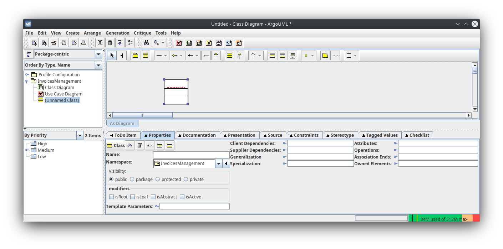

In the "attributes" and "operations" sections, we place everything (attributes and methods) related to the class. It is necessary to specify the name of the attribute or method, its visibility, its type, and its parameters (in the case of the method), separately. In this main tab, we mark the characteristics of the class itself, such as being abstract (as shown in the following figure).

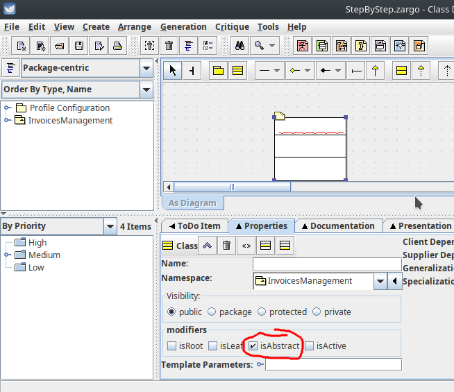

When a class is selected, a different kind of link could be used:

## Recommended configuration

I recommend you to **show name of nodes in bold font** with `File/Project Properties/Diagram Appearance`:

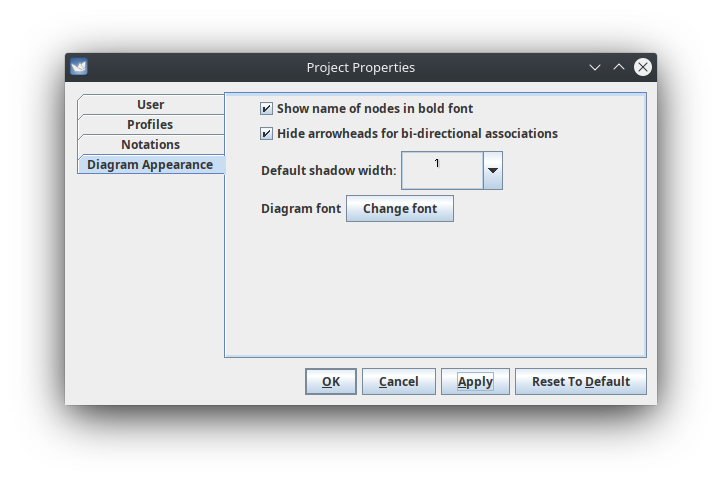

And to **show visibility** with `File/Project Properties/Notations`:

## The example step by step

### Create classes

Create three classes hierarchy, first create one of them (for example `Invoice` and after that create two childclasses: `ServicesInvoices` and `ProductsInvoices`). After that select each one and add the name in the Properties tab. Then you should see something like this:

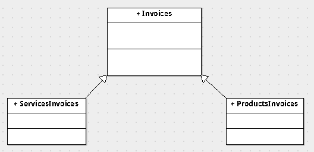

### Add attributes and methods

Add attributes for each class, take care of selecting correct visibility for each attribute (by default private), and also select the correct data type. You get this:

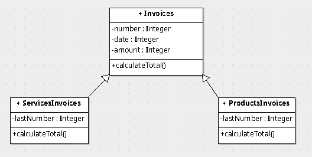

### `ClientData` class

As said by the problem: "*Customer data, which is the NIF and name, and must be found in a separate class.*", so let's add as an Aggregation, because the client only has sense with an invoice. You need to select the correct button in the toolbar and then click and drag from one class (`Invoices`) to the other (`ClientData`)

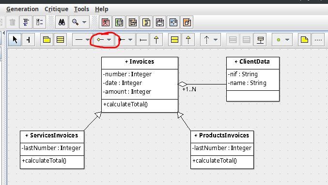

### `Services` and `Hours` Class

From the line "*There is a list of services with the description and price per hour of each.*" we extract that the `Services` class has two attributes (`description` and `hourPrice` ). And from "*...each invoice contains a list of services with the date of service, the number of hours spent, and the price / hour per service. There may be more than one benefit from the same service on an invoice.*" we need an associated `Hours` class with two attributes (`numberHours` and `description`):

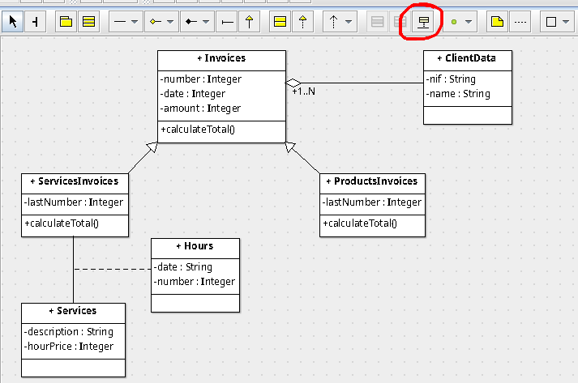

### `InvoiceProduct` Class

Last line says: "*Product invoices must include a description, unit price, and quantity for each product (each invoice must have at least one).*" so we need a `InvoiceProduct` class with three attributes (`description`, `unitPrice`, `quantity`) and the relation with `ProductsInvoices` class is a composition, be sure to select the correct button:

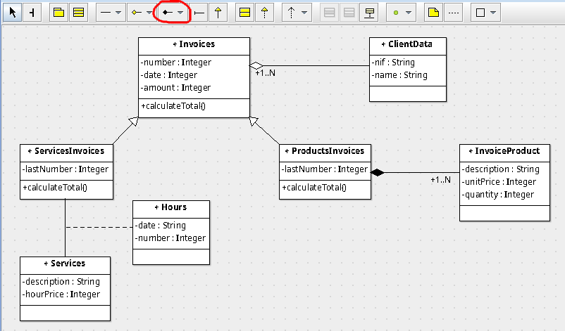

# Exercises

## Argo_01

 Download `ArgoUML` for your Operating System and follow this step by step guide until point 3 (included) and send through AULES the `YOURNAME.zargo` file with this project. 

> **AULES** does not allow you to send *.zargo* file so, you have to compress to a zip file and send that file.

## Argo_02

Complete the example on the youtube video from AULES about `Case Use Diagram` ("Empresa  pedidos") completing it with the following instructions:

1. Draw the context diagram of the system.
2. Generate 3 case use description templates (different of the example).
3. Complete the final diagram.

Also, you have to add:

1. At least two hierarchy examples for actors.
2. A relationship with actors/systems outside our system.

Use your knowledge about real system to complete the case uses that are not visible on the youtube video.

Send through AULES the `YOURNAME.zargo` file with this project. 

> You could use this link as a guide: https://docplayer.es/90376253-Desarrollo-de-un-diagrama-de-casos-de-uso-mediante-el-software-argouml.html

## Argo_03

Following point 4 of this guide generate the sources for the project in exercise `Argo_01` in Java and send it through AULES site.

## Argo_04

Generate an UML class diagram from sources of the project that you choose from Unit05 of development (`gestionEmpleados`, `gestionHospital`, `contrarreloj`, `reservasLibreria`, `gestorCorreoElectronico`, `juegoDeCartas`). Explain how you do it with a memory in `pdf`, and send then `pdf` and `.zargo` file together in a zip through AULES.
# Fuentes de información

- [Apuntes IOC (Marcel García)](https://ioc.xtec.cat/materials/FP/Recursos/fp_dam_m05_/web/fp_dam_m05_htmlindex/index.html)
- [Uso de *argoUML* para diseño de aplicaciones](http://jbgarcia.webs.uvigo.es/asignaturas/TO/usoArgoUML/index.html)
